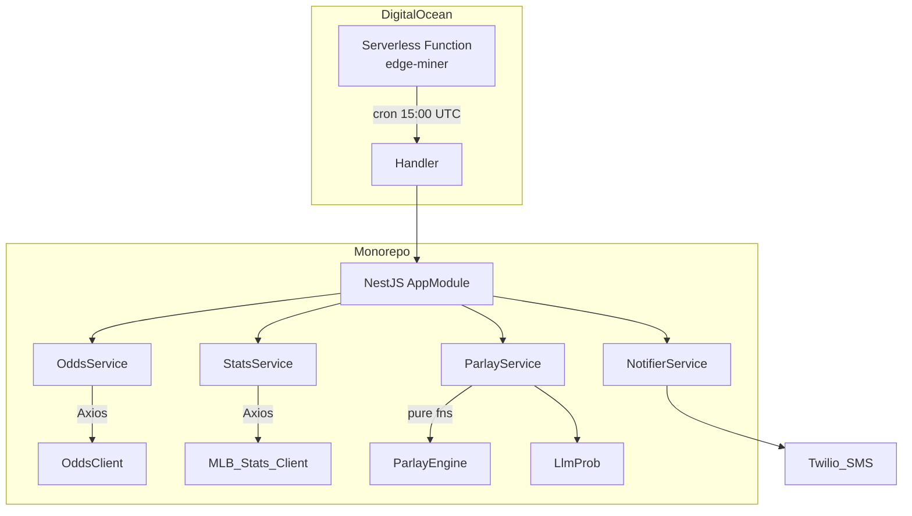

# Parlay Edge-Miner

A serverless monorepo that identifies positive-edge (\+EV) 2–3 leg MLB money-line parlays daily and sends them via SMS.

---

## Architecture



---

## Deployment Target

The build pipeline (GitHub Actions `deploy.yml`) produces a Docker image (`registry.digitalocean.com/parlay-edge/edge:<sha>`).  That image contains the compiled NestJS serverless bundle located at `apps/edge-miner/dist`. The image is pushed to DigitalOcean Container Registry (DOCR) and referenced by the `digitalocean_functions_function.edge_miner` resource in Terraform.

At runtime DigitalOcean Functions executes `dist/handler.js` on a daily cron (`0 15 * * *`).

## LLM Tracing

No LangChain, LangSmith or LangGraph frameworks are included.  A minimal `trace()` helper is provided in `@parlay/common-config` that simply logs structured trace events via Pino when `LANGCHAIN_TRACING=true`.

## Environment Configuration

Runtime configuration is supplied exclusively through environment variables (validated by Zod).  See `infra/terraform/variables.tf` for the authoritative list.

---

*All command-line examples have been removed from this document to avoid drift; refer to CI workflow files (`ci.yml`, `deploy.yml`) and package manifests for the current canonical build and test steps.*

---

## Adding a New Sport

1. Implement a `<sport>-stats` client package mirroring `mlb-stats`.
2. Update `OddsService` to fetch the new sport key.
3. Extend `ParlayService` to include the new legs.

---

## Teardown

```bash
terraform -chdir=infra/terraform destroy
# Delete container registry when finished
```

---

## License

MIT © 2025